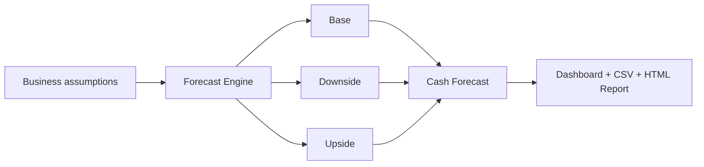

```mermaid
flowchart LR
    A[Business assumptions] --> B[Forecast Engine]
    B --> C[Base]
    B --> D[Downside]
    B --> E[Upside]
    C --> F[Cash Forecast]
    D --> F
    E --> F
    F --> G[Dashboard + CSV + HTML Report]
```
