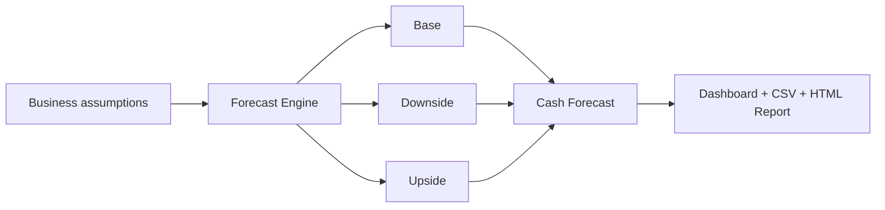

## At a glance

| Capability | Included |
| --- | --- |
| 12-month forecasting | Yes |
| Scenario modeling | Base / Downside / Upside / Custom |
| Cash runway | Yes |
| Break-even analysis | Yes |
| CSV export | Yes |
| HTML management report | Yes |
| Live accounting integration | No |
