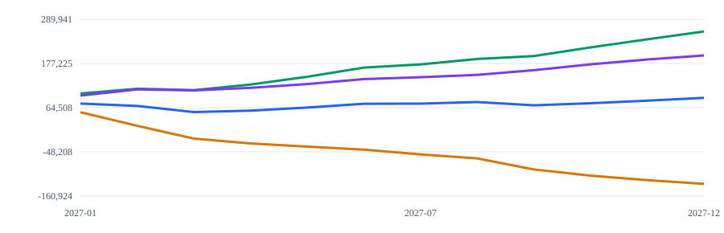

# SMB Cash Flow & Forecasting Model

An independent FP&A portfolio project by **Lavonte Jones**. Build a monthly operating plan, compare scenarios, and see when invoiced revenue actually becomes available cash. The included business and all sample figures are synthetic.

Profitable businesses can still run short of cash when customers pay slowly, new hires start, equipment is purchased, or debt payments fall due. This model separates operating performance from cash timing and makes each calculation inspectable.

## What it does

- Forecasts revenue with monthly growth, calendar seasonality, and individual month overrides.
- Models COGS or gross margin, fixed and variable operating expenses, existing payroll, and planned hires.
- Schedules customer collections, supplier payments, opening receivables/payables, and assumed tax payments.
- Includes capital expenditures and optional debt draws, interest, and principal repayments.
- Produces monthly gross profit, operating income, cash inflows/outflows, ending cash, runway, and operating break-even estimates.
- Compares base, downside, upside, and custom scenarios with signed variances against the baseline.
- Provides an editable local dashboard, scenario cash charts, spreadsheet-ready CSVs, detailed JSON, and a portable HTML management report.
- Reconciles direct cash flow against an indirect profit-to-cash bridge every month.

## Run the sample

Python 3.9 or newer. The model, dashboard, and tests use the standard library; no runtime packages, credentials, API calls, environment variables, or paid services are required.

From this project directory:

```sh
python3 -m smb_forecast forecast examples/sample-business.json --out output
python3 -m smb_forecast serve
```

Open `output/report.html` for the management report, or visit `http://127.0.0.1:8765` for the dashboard. Keep the dashboard terminal running; press Ctrl+C to stop it. If the port is occupied, use `python3 -m smb_forecast serve --port 8766`.

The dashboard lets you select a scenario, change assumptions, and recalculate. Changes are applied only after successful validation. Export buttons use the **last successfully calculated inputs**, not unsubmitted edits. Use **Save assumptions** to retain changes; there is no automatic persistence. **Load assumptions** imports a JSON model. Base horizon changes may require updating dated schedules in every scenario.

Optional installation in a virtual environment exposes the `smb-forecast` command:

```sh
python3 -m venv .venv
.venv/bin/python -m pip install .
.venv/bin/smb-forecast validate examples/sample-business.json
```

On Windows, use `python` and `.venv\Scripts\python` / `.venv\Scripts\smb-forecast` as appropriate. Installation may download the build tool; direct execution above requires no downloads.

## Sample management findings

The fictional business begins with $100,000 cash, earns revenue unevenly through the year, collects invoices over three months, hires an operations role in July, and buys equipment in March and September. An assumed 20% tax rate illustrates arithmetic only.

| Scenario | Forecast revenue | Operating income | Ending cash | First negative cash month |
|---|---:|---:|---:|---|
| Base | $1,524,083.28 | $95,800.79 | $89,576.87 | None in horizon |
| Downside | $1,244,941.07 | −$115,675.35 | −$129,829.62 | March 2027 |
| Upside | $1,755,076.31 | $261,639.69 | $258,846.61 | None in horizon |
| Custom | $1,524,083.28 | $134,800.79 | $197,689.38 | None in horizon |

These are modeled results, not measured client outcomes. The custom scenario removes the planned hire, replaces the equipment schedule, and shortens collection timing. Negative cash remains visible as a modeled funding gap; the engine does not automatically borrow to fill it.

Review the committed [HTML report](examples/outputs/report.html), [base CSV](examples/outputs/base.csv), [scenario JSON](examples/outputs/forecast.json), and [worked example](docs/worked-example.md). Download the HTML file and open it locally; GitHub's source view does not render the report.



Blue: base. Amber: downside. Green: upside. Purple: custom. Vertical axis: currency units. All plotted figures come from the committed forecast output.

## Inputs, formulas, and outputs

The [input dictionary](docs/assumptions.md) specifies every field, its units, defaults, and validation boundaries. The [formula reference](docs/formulas.md) explains each major calculation and timing convention.

Rates are decimal fractions in JSON: `0.01` means **1% monthly growth**, not annual growth. Seasonality uses January–December calendar factors. Choose exactly one of `gross_margin` or `cogs_rate`. Scenario patches replace entire values at the top level: a new `capex` object **replaces** the baseline capex schedule; it does not merge individual months.

Example input:

```json
{
  "schema_version": 1,
  "model_name": "Synthetic example",
  "currency": "USD",
  "assumptions": {
    "start_month": "2027-01",
    "months": 12,
    "monthly_revenue": 100000,
    "monthly_growth_rate": 0.01,
    "gross_margin": 0.55,
    "fixed_opex": 12000,
    "variable_opex_rate": 0.05,
    "payroll": 30000,
    "beginning_cash": 100000,
    "collection_weights": [0.4, 0.4, 0.2],
    "payment_weights": [0.25, 0.75]
  },
  "scenarios": {
    "downside": {"monthly_revenue": 85000},
    "upside": {"monthly_revenue": 115000},
    "custom": {"fixed_opex": 14000}
  }
}
```

Each forecast export contains resolved assumptions, monthly rows, and summary metrics. CSVs expose all cash and working-capital calculations, including reconciliation differences. Blank CSV runway means no recent burn; blank break-even means nonpositive contribution margin. Output JSON stores decimal values as strings to preserve exact cents; it is a **result**, not an assumption file. Reuse `sample-business.json` or the dashboard's saved inputs to rerun a model.

## Architecture

| Component | Responsibility |
|---|---|
| `smb_forecast/model.py` | Strict input validation, Decimal formulas, cohorts, reconciliation, scenarios |
| `smb_forecast/report.py` | CSV generation, escaped HTML, standalone SVG cash chart |
| `smb_forecast/server.py` | Loopback-only dashboard and bounded JSON API |
| `smb_forecast/web/` | Assumption editor, scenario charts, downloads, monthly table |
| `smb_forecast/__main__.py` | Forecast, validation, and dashboard commands |
| `tests/` | Worked examples, randomized invariants, interfaces, security boundaries |
| `scripts/verify_repository.py` | Reproducible sample outputs and public-content checks |

The browser submits assumptions to the local Python engine. The engine validates inputs, computes the baseline and scenario patches, reconciles balances, and returns results. The CLI and dashboard use the same calculation implementation.

## Validation

```sh
python3 -m unittest discover -s tests -v
python3 scripts/verify_repository.py
```

Tests cover independently calculated examples, monthly growth, calendar seasonality, COGS equivalence, hires, capex, debt, tax timing, opening balances, invoice allocation, runway, break-even, scenario differences, invalid inputs, report escaping, CLI exports, and HTTP request restrictions. A fixed-seed set of 120 forecasts checks cash and working-capital conservation across varying horizons and assumptions. Integration tests bind a temporary loopback port.

The included GitHub Actions workflow runs the tests on Python 3.9 and 3.12, checks export reproducibility, tests optional package installation, and performs browser smoke checks when this source is uploaded to GitHub. Browser validation uses a development-only Playwright dependency; it is not needed to run the product. See [audit notes](docs/audit.md) for the actual verification status and remaining limitations.

## Commercial use case

This demonstrates a deliverable a freelance FP&A engagement could scope: document operating assumptions, build a monthly model, test collection/payment timing, compare scenarios, and produce an owner-readable management reporting pack. A client adaptation would include source-data mapping, assumption review, opening balance reconciliation, actuals integration, acceptance checks, and a defined handoff. The sample does not claim client savings, revenue improvements, or predictive accuracy.

## Scope and limitations

- This is a deterministic management-planning model, not a complete accounting system or probabilistic forecast.
- COGS is a revenue share. Inventory purchasing and inventory balances are not modeled.
- Supplier timing applies only to COGS; payroll and other operating expenses are paid in the month incurred.
- Hires add a user-entered monthly cost from their start month through the horizon. Benefits and payroll taxes must be included in that assumed cost.
- Capex is a cash outflow; depreciation and amortization are absent. Operating income is before depreciation.
- Taxes use a configurable rate on positive operating income less interest, with a fixed payment lag. No jurisdiction rules, loss carryforwards, credits, deductions, or tax advice are provided.
- Debt interest/principal are explicit schedules; no amortization, covenant, or rate calculation is implied. Equity funding, owner distributions, and currency conversion are absent.
- Collections and payments assume eventual settlement of all modeled invoices; there is no bad-debt or supplier-default assumption. Remaining balances beyond the horizon stay in ending AR/AP/tax liabilities.
- Runway is a trailing-burn heuristic. Break-even is an operating estimate before interest, taxes, capex, and timing effects.
- The local dashboard has no authentication or persistence and is designed for a single local user, not public hosting.

All committed material is synthetic. Keep private inputs in an ignored `local-data/` folder. This tool provides calculations only and does not provide financial, tax, legal, or investment advice.

MIT licensed; all included samples were authored for this project.
